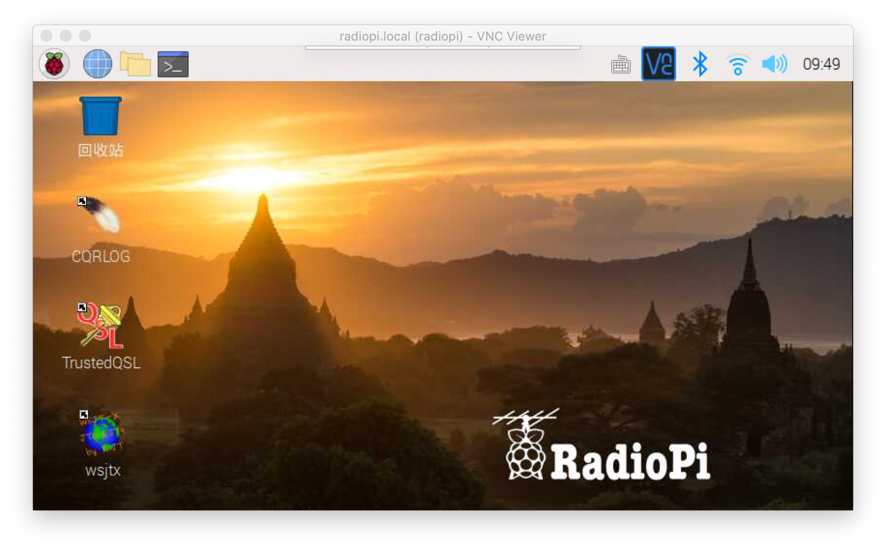
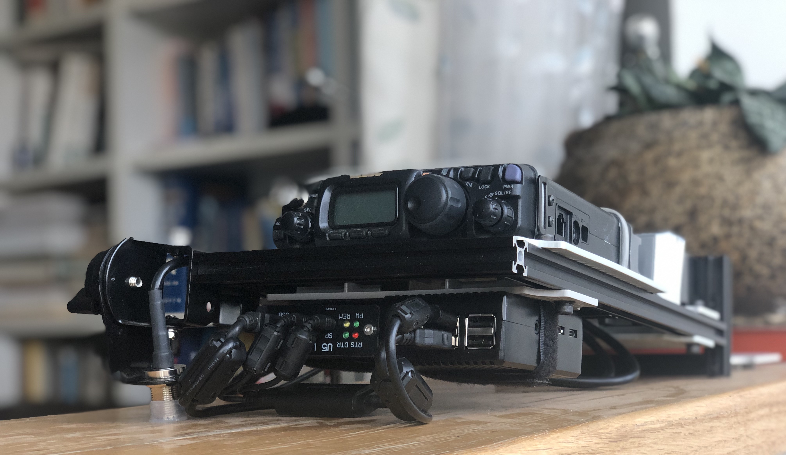

## RadioPi，Ham的树莓派懒人包

如果你想玩树莓派远程控制电台，但是又苦于Linux系统太繁琐，那你可以试试RadioPi。这是一个配置好了的树莓派操作系统懒人包，安装了常用的HAM软件，对远程控制做了优化。你只要下载了它，烧个SD卡，往树莓派里一插，开机就能用。

**RadioPi能干这些事：**
- 控制电台，玩FT8，记通联日志，上传LOTW挣DXCC积分。
- 一边在公园遛弯儿，一边用手机遥控家里电台。
- 去野外通联不用带笔记本电脑了。

我们三个搞互联网的HAM，BG6LH、BG1TPT、BI1EIH，结合自己使用树莓派的体验，一起做了这个RadioPi系统镜像。 如果你也想体验这些乐趣，下载一个试试吧。

- 下载地址：[https://pan.baidu.com/s/17HxJHYbyRwxaK_dh4-24WA](https://pan.baidu.com/s/17HxJHYbyRwxaK_dh4-24WA)
- 提取码：02e7
- SHA-256：99ab3ec6125cc07d878746d810a1d74db3db7bada44e5373ae1b7681da3e07f3

如果你了解SHA校验，可以比对一下校验码，确保下载的文件准确无误。

注意：刚下载的RaidoPi镜像是一个zip压缩包，烧卡之前要先解压缩，得到一个后缀是.img的文件。这个就是RadioPi镜像文件。

### RadioPi简介

RadioPi镜像是基于树莓派官方操作系统的再发布版本。我们是有洁癖的工程师，努力把它做的跟官方镜像一样干净，除了HAM常用的软件，别的都没装。

这些软件是：
- WSJT-X 2.2.0，已中文支持。
- JTDX 2.1.0-RC150，可选中文界面。
- TQSL 2.4.3，已中文支持。
- CQRLOG 2.3.0，Linux世界最好用的日志软件。
- GQRX 5.11.3，软件无线电接收。
- GNU Radio Companion 3.7.13.4，软件无线电工具包。
- VNC Server 6.7.1，远程控制服务。

这些软件需要你自己完成开机设置，比如与电台的连接、呼号和LOTW账号等等。我们希望RadioPi能满足Ham的核心需求，也希望它尽量稳定，所以一些软件是最新的，一些是次新的。欢迎各位推荐更好用的软件，我们在以后的版本里预装。

**RadioPi还做了：**

- 中文化的界面，预装谷歌拼音输入法。
- 预装时间同步软件、GPS的驱动。
- 精简了跟HAM无关的软件。
- 配置好了CQRLog的数据库，修订了它上传LOTW的Bug。
- 配置好了SSH、VNC、Avahi服务。
- 预存了一个叫radiopi的Wi-Fi连接，以便于野外通联。

**RadioPi的默认用户名和密码：**

- 用户名：pi
- 密码：radiopi599

**RadioPi的默认主机名：**

- 主机名：radiopi

RadioPi配置了自动广播主机名的Avahi服务，你可以在支持mDNS协议的其它设备上直接访问radiopi.local找到它。详情请参考《无头操作RadioPi》。

我们把RadioPi设置为开机自动登录到桌面，这是为VNC远程控制做的一个优化。第一次登录后，建议你立刻修改用户pi的密码。

### 使用前的准备

使用RadioPi之前，需要做的一些准备：
- microSD卡，也叫TF卡、手机存储卡，推荐8G以上高速卡。
- USB的TF卡读卡器，或者TF转标准SD卡的卡套，烧卡用。
- 电脑，烧卡用。
- 烧卡软件：
  - Windows下，推荐使用[Win32DiskImager](https://sourceforge.net/projects/win32diskimager/)。
  - MacOS下，推荐使用[balenaEtcher](https://www.balena.io/etcher/)。
- 树莓派
  - 推荐购买Pi 4 model B，至少2G内存的版本。
- 如果你的树莓派不带Wi-Fi，建议买一个USB Wi-Fi网卡。
- 还可以准备一个USB GPS，获得更高精度的时间。这需要在radiopi上做一点点额外的配置。
- 显示器、键盘、鼠标，给树莓派用。

你也可以不用显示器、键盘和鼠标，以“无头(headless)”的方式使用RadioPi。RadioPi已经配置好了SSH、VNC、Avahi等等服务，并针对远程控制做了优化。所谓“远程控制电台”就是通过这些实现的。这才是玩树莓派的重点。关于这部分请参考《无头操作RadioPi》。

无头操作RadioPi需要在其它电脑、或手机上安装VNC Viewer软件。它类似QQ的“远程协助”，能把RadioPi“投射”到另一台电脑或手机上，实现远程操作。

**VNC Viewer下载地址：**

- [https://www.realvnc.com/en/connect/download/viewer/](https://www.realvnc.com/en/connect/download/viewer/)
- 对于安卓手机用户，国内的应用商店可能没有。推荐从RealVNC公司直接下载[.apk安装包](https://help.realvnc.com/hc/en-us/articles/360002762697)。

此外，根据电台的情况，你可能还需要准备一个USB声卡、以及USB转CAT的控制设备。比如YAESU FT-817就需要这些，而ICOM IC-7300就不用，直接用USB线接RadioPi和电台就可以了。

上图：一套FT-818和RadioPi的便携集成

### 安全提示
- RadioPi上的软件大部分基于Hamlib开源工具库，已经发展了二十年，成功且稳定。但是这些软件目前仍在更新，所以没人保证它们和每一个软件、每一个电台都能有完美的配合。
- 树莓派的硬件并非专门为射频工况设计，所以使用树莓派控制电台有一定的风险。当你用它和大功率电台、非平衡天馈系统一起工作时，不良的驻波、不佳的平衡与接地，都有可能对树莓派、电台及周边设备带来射频干扰。
- 我们使用过的电台有限，主要包括过FT-817/818、IC-7000/7300、D4D等，使用的天线包括端馈的长线、PAC12、G5RV、甚至小环天线。无论是QRO还是QRP操作，都有过上述的经历。
- 所以认真对待平衡、接地、驻波等问题是非常必要的，尤其在远程操作无人值守的电台时更要注意这些问题。
- 解决这些问题也是玩业余无线电的乐趣之一。

### 使用协议
- 下载和使用RadioPi镜像表示你已同意自行承担使用它的风险和责任。
- 请确保自己在法律法规许可范围内操作计算机、无线电设备和互联网。
- RadioPi 镜像遵循“[创作共享 署名-相同方式共享 CC BY-SA 协议](https://creativecommons.org/licenses/by-sa/4.0/deed.zh)”。

 
 

73！

BG6LH、BG1TPT、BI1EIH

2020年6月

